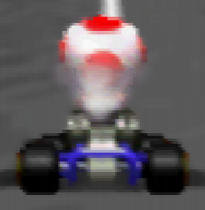

# u64aap
N64 video mode patcher.
This is a fork of [saturnu's u64aap](https://github.com/saturnu/u64aap).

## Results

Tested with Retroarch Mupen64Plus-Next Core and Angrylion RDP plugin:



## Build
```
git clone git@github.com:kcghost/u64aap.git
cd u64aap
git submodule update --init
make
```

## Usage

```
-== N64 AA-patcher ==- by saturnu

u64aap - -== N64 AA-patcher ==-
by saturnu <tt@anpa.nl>

Input/Output: (required)
 -i, --input=filename.z64   N64 Rom in z64 format
 -o, --output=filename.z64  N64 Rom in z64 format

Filter options: (default: untouched)
 -a, --gc-on        set Gamma correction ON
 -c, --gc-off       set Gamma correction OFF
 -b, --gd-on        set Gamma dithering ON
 -g, --gd-off       set Gamma dithering OFF
 -e, --di-on        set DIVOT ON
 -d, --di-off       set DIVOT OFF
 -j, --df-on        set Dither filter ON
 -f, --df-off       set Dither filter OFF

Extra options:
 -q, --dummy        just test - don't output file
 -s, --swap     swap VideoTable region (new experimental)
 -n, --no-anti-aliasing disable AA in VideoTable, too
 -k, --fast3d       search F3D SETOTHERMODE_L (highly experimental)
 -2, --f3dex2       search F3DEX2 SETOTHERMODE_L (highly experimental)
 -l, --videolist    patch VideoList - [stackable] (highly experimental)

Information:
 -h, --help     display this help and exit
 -v, --verbose      verbose
 -z, --version      version info
```

Typical usage:
```
./u64aap -n -i "Mario Kart 64 (USA).z64" -o "Mario Kart 64 (USA) (NoAA).z64"
./n64crc "Mario Kart 64 (USA) (NoAA).z64"
```

`u64aap` will modify the ROM but not fix the CRC on it's own.
`n64crc` fixes the CRC values in place so the ROM can be considered valid again.
